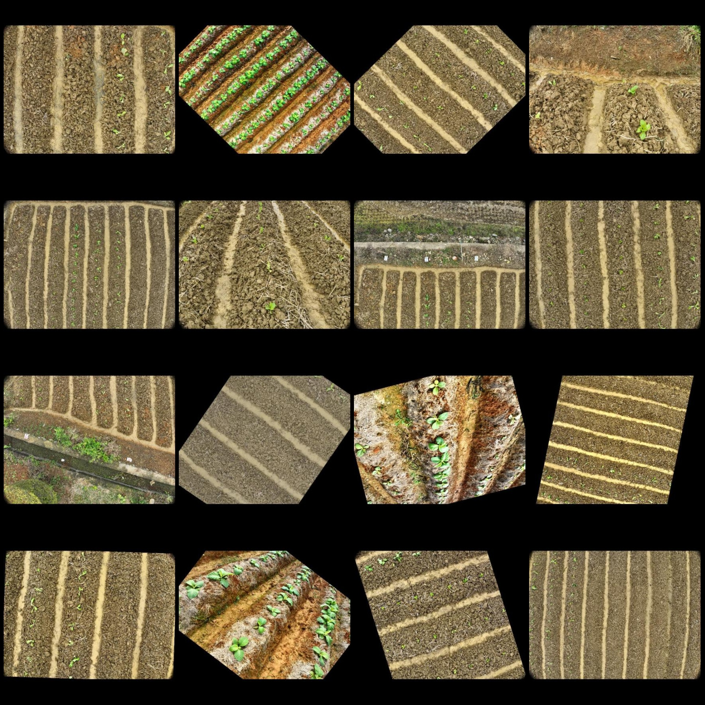
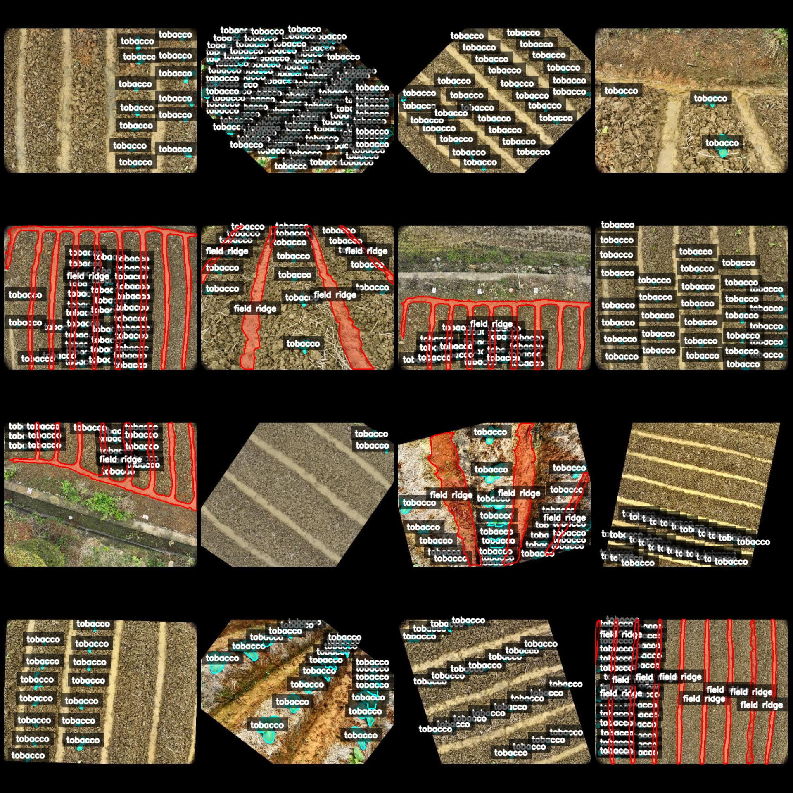
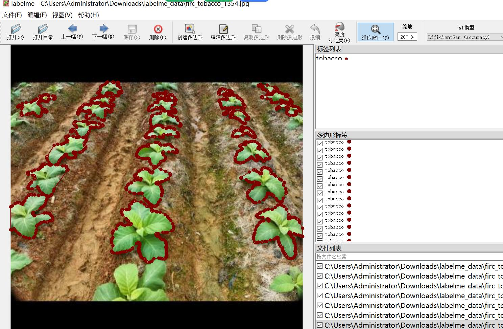

# Drone Perspective Tobacco Plant Sprout Rate Identification and Segmentation Dataset in LabelME Format - 1931 Images in 2 Categories

Please note that the dataset contains many rotated enhanced images and some fields are not labeled.

Data Format: LabelME format (excluding mask files, only containing jpg images and corresponding json files).

Number of Images (JPG file count): 1931
Number of Annotations (JSON file count): 1931
Number of Annotation Categories: 2
Annotation Category Names: ["field ridge", "tobacco"]
Number of Boxes per Category:
- field ridge (Fields) count = 1583
- tobacco (Tobacco sprouts) count = 64468
Total Boxes: 66051

Usage Tool: LabelME v5.5.0
Image Resolution: 432x432
Annotation Rules: Polygon is drawn around categories
Important Notice: The dataset can be opened for editing in LabelME, but the JSON dataset needs to be converted into a mask, Yolo format, or COCO format for semantic segmentation or instance 
segmentation.
Special Remark: This dataset does not guarantee the accuracy of the trained model or weight files.

Image Preview:
Annotation Example:
Randomly selected 16 images:
Annotation drawing results:

## Picture

Here is a pay link on Stripe ( https://buy.stripe.com/3cs8yP7sY87d0vu9AB ). Please contact me lonlonago@foxmail.com after funding $89, and I will send you a complete data files , thank you!

